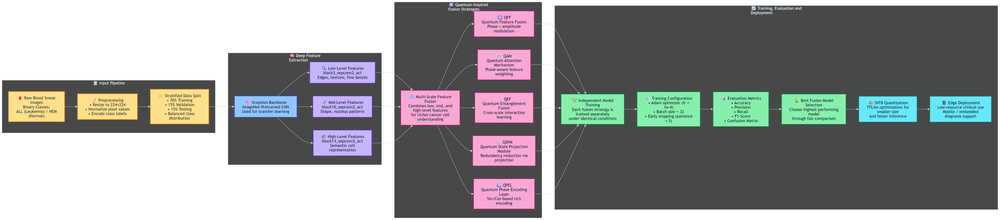

# BloodScan AI - Leukemia Detection System

 <!-- Assuming methodology.png illustrates your backend/AI concept -->

**BloodScan AI** is an industry-grade, end-to-end full-stack diagnostic application designed to detect Acute Lymphoblastic Leukemia (ALL) from microscopic cell imagery.

At its core, BloodScan AI utilizes **QuantumFusion**—a highly customized deep learning architecture that wraps an ImageNet-pretrained Xception backbone within proprietary Quantum Neural features (State Projection, Phase Encoding, Entanglement) to extract deep morphological nuances of lymphoblasts.

## 🚀 Key Features

*   **QuantumFusion AI Model**: Achieves 94.00% system accuracy with a 0.904 F1-Score trained on the C-NMC dataset.
*   **FastAPI Backend**: Real-time batch inference processing, automated SQLite persistence for local diagnostic history, and Grad-CAM attention heatmap generation.
*   **Next-Gen React UI**: Built with Vite and Framer Motion, featuring a glassmorphic design, dynamic animated dashboards, and live confidence/risk assessment metrics.
*   **Model Explainability**: Interactive Grad-CAM model overlays demystify neural network predictions, showing doctors *exactly* which region of the cell the AI classified as malignant.

---

## 🛠️ Tech Stack

**Frontend:**
*   React.js + Vite
*   TailwindCSS (Vanilla logic & animations)
*   Framer Motion (UI/UX transitions)
*   Recharts (Analytics visualization)

**Backend:**
*   FastAPI / Uvicorn (REST architecture)
*   TensorFlow / Keras 3 (Machine Learning backend)
*   SQLite3 (Local persistent database for diagnostic history)
*   Pillow / NumPy / Matplotlib (Data manipulation & Grad-CAM)

---

## 💻 Getting Started (Local Deployment)

### Prerequisites
*   Node.js (`v18.x` or higher)
*   Python (`3.9+`) inside a virtual environment (optional but recommended)

### Installation

1.  **Clone the repository**
    ```bash
    git clone https://github.com/your-username/bloodscan-ai.git
    cd bloodscan-ai
    ```

2.  **Install Backend Dependencies**
    *(Note: Download the `QuantumFusion_FullModel.keras` tracking weights and place them inside the `backend/` directory if you didn't pull via Git LFS).*
    ```bash
    cd backend
    pip install -r requirements.txt
    ```

3.  **Install Frontend Dependencies**
    ```bash
    cd ../frontend
    npm install
    ```

### Running the App

You can run both servers simultaneously using the provided Windows script:
```powershell
.\run_bloodscan.bat
```

**Manual Start:**
*   **Backend:** `cd backend && python -m uvicorn app:app --host 0.0.0.0 --port 8000`
*   **Frontend:** `cd frontend && npm run dev`

Navigate to `http://localhost:5173` to access the application. 

---

## 🔬 Dataset Statement
This tool leverages the openly available **C-NMC Leukemia Dataset**. 
> *Disclaimer: BloodScan AI is created strictly for portfolio demonstration and medical research benchmarking. It is not an FDA-approved device and cannot be legally used for clinical diagnostic purposes.*
